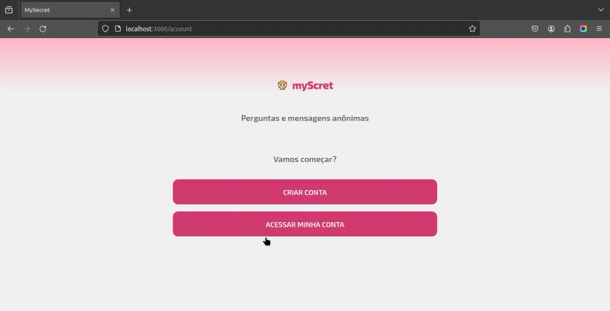

<h1 align="center">
  <br>
    
  <br>
  MySecret
  <br>
</h1>

<h4 align="center">
    An anonymous question and answer app
</h4>

<p align="center">
  <a href="#about">About</a> •
  <a href="#key-features">Key Features</a> •
  <a href="#languages-and-technologies">Languages and technologies</a> •
  <a href="#prerequisites">Prerequisites</a> •
  <a href="#how-to-use">How To Use</a> •
  <a href="#contact">Contact</a> •
</p>

<div align="center">

[](https://myscret.vercel.app)
</div>


<div style="width: 100%">

</div>

## About
This was a simple application inspired by the project developed during the 'Semana DDEV' event led by software engineer <a href="https://www.linkedin.com/in/odanieldcs/">Daniel Castro</a>. In this application, I focused on architecture, design patterns, and various other programming best practices, thereby ensuring greater efficiency in project maintenance and extensibility.

## Key Features

- Create an account.
- Authentication.
- Create a question and generate a link.
- Answer a question anonymously or not.
- View answer for all your questions.
- View all the answers you've created.

## Languages and technologies
Front-end: 


Back-end: 


Arquitetura: Clean Architecture, DDD, SOLID, Design Patterns

## Prerequisites

To run the project on your machine, you must have <a href="https://nodejs.org/en">Node.js</a> and <a href="https://www.docker.com/">Docker</a> installed, preferably both in their latest stable version.

## How To Use

### Clone this repository
```bash
# Clone this repository
$ git clone git@github.com:joseuilton/myscret.git

# Go into the repository
$ cd myscret
```

### Run Docker compose

You can configure the PostgreSQL image according to your preference in the 'docker-compose.yml' file or follow the default configuration.

```bash
# Run docker compose with PostgreSQL image
$ sudo docker compose up -d
```

### Configure and run API

add a ".env" file with database's configuration, follow the structure of ".env.sample"

```bash
# Install all dependencies
$ npm install

# Install Knex globally
$ npm install knex -g

# Run all migrations
$ npm run migration:latest

# Run API
$ npm run dev
```

### Run App
```bash
# Install all dependencies
$ npm install

# Run App
$ npm run dev
```

## Contact
José Uilton - [@joseuilton](https://www.linkedin.com/in/joseuilton/) - joseuilton.siqueira@gmail.com

Project link: https://github.com/joseuilton/myscret

---
Made with :purple-heart: by José Uilton